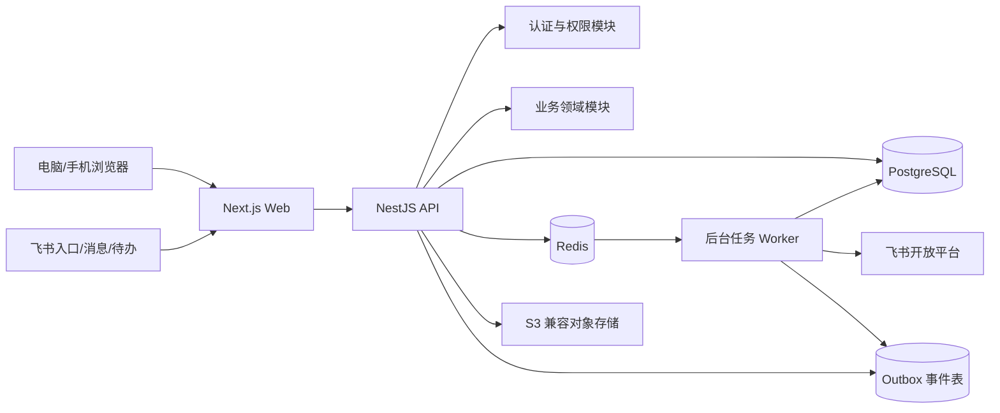
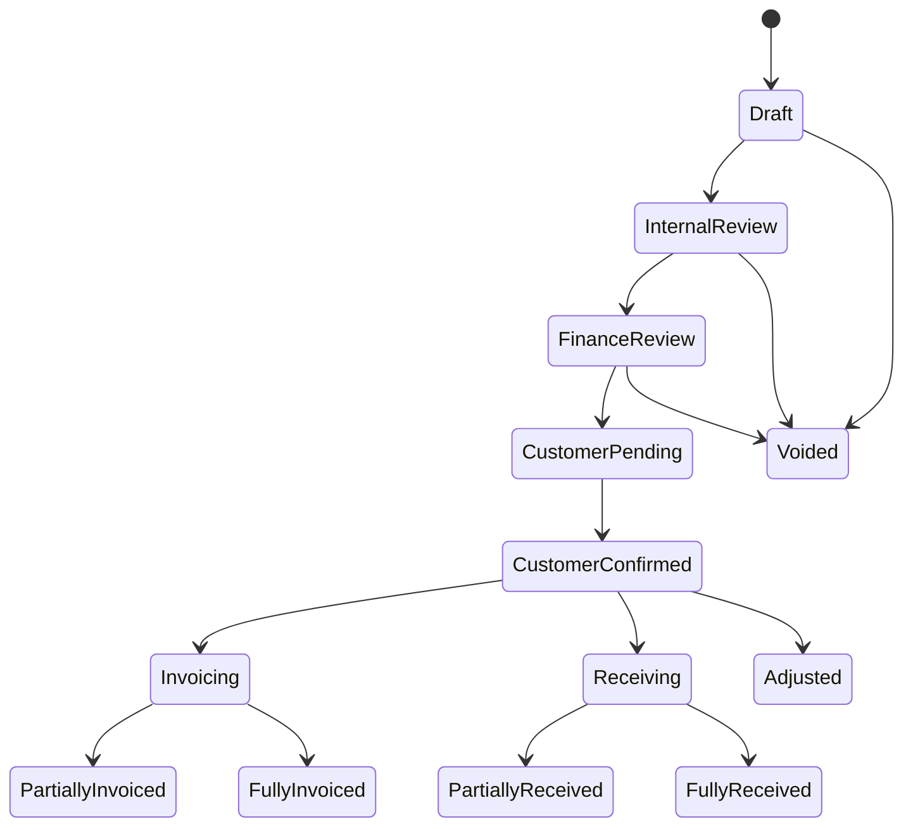
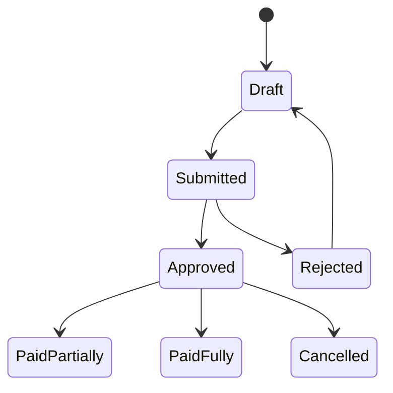
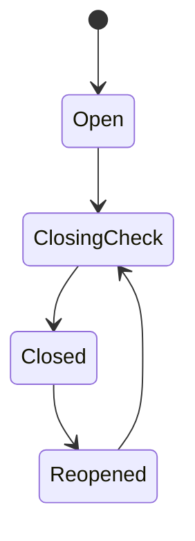

# erpdog 技术架构方案

日期：2026-04-29  
状态：草案，待确认  
对应 PRD：`docs/plans/2026-04-29-internal-erp-prd.md`

## 1. 设计目标

erpdog 是内部长期服务型业务 ERP。第一期上线后要直接替代 Excel，成为唯一业务与财务台账，因此技术方案优先保证数据正确性、权限可控、操作可追溯、代码可维护，其次再做性能优化和横向扩展。

核心设计目标：

- 财务数据准确：金额不用浮点数，所有关键变更有事务、约束和审计日志。
- 流程可追溯：账单、发票、收款、成本、应付、付款、结账、解锁均有状态流和操作日志。
- 权限严格：角色权限 + 客户级数据权限，飞书入口也不能绕过 ERP 权限。
- 性能稳定：支持 10-50 内部用户、50-300 客户、每月几百张账单，并为 10 倍增长留空间。
- 兼容性好：电脑浏览器完整操作，移动端处理关键事项，支持 Excel 导入导出和 S3 兼容对象存储。
- 扩展性清晰：一期先做财务闭环，二期接飞书深度集成和报表增强，不提前做微服务。
- 代码简洁：按领域模块组织，控制器薄、业务用例清楚、数据访问集中、状态流显式。

## 2. 架构结论

推荐采用 **TypeScript 全栈模块化单体架构**：

- 前端：Next.js + React + TypeScript。
- 后端：NestJS + TypeScript，提供 REST API。
- 数据库：PostgreSQL。
- ORM/迁移：Prisma，复杂约束和报表视图允许补充手写 SQL migration。
- 任务队列：Redis + BullMQ。
- 文件存储：S3 兼容对象存储，例如云厂商 OSS/COS 或 MinIO。
- 部署：Docker Compose 起步，后续可迁移到容器平台或托管服务。

不建议第一期直接上微服务。当前团队规模和业务量不需要承担分布式事务、跨服务调用、链路追踪和多仓库协作成本。模块化单体可以保持一次部署、一次事务、统一权限，同时通过清晰模块边界为未来拆分预留路径。

## 3. 高层架构



运行时分为三个进程：

- `web`：Next.js 前端，负责页面、路由、表单和移动端适配。
- `api`：NestJS 后端，负责认证、权限、业务事务、REST API 和文件签名。
- `worker`：后台任务进程，负责每月 1 日生成账单、通知、逾期提醒、报表预计算、导入任务。

三者放在一个 monorepo 中开发，部署时可独立构建和扩容。

## 4. 项目结构建议

```text
erpdog/
  apps/
    web/                 # Next.js 前端
    api/                 # NestJS API
    worker/              # BullMQ 后台任务
  packages/
    config/              # 环境变量、共享配置
    contracts/           # API 类型、枚举、OpenAPI 生成物
    eslint-config/       # 代码规范
    tsconfig/            # TypeScript 基础配置
  prisma/
    schema.prisma
    migrations/
  docs/
    architecture/
    adr/
    plans/
  scripts/
    import-templates/
    ops/
```

代码原则：

- 前端不直接访问数据库，只调用 API。
- API 控制器只做参数解析、权限入口和返回响应。
- 业务逻辑放在 use case/service 层。
- 数据访问放在 repository/query 层。
- 跨模块交互优先通过公开 service 或领域事件，不直接穿透修改别的模块表。
- 所有金额字段使用 `bigint` 分单位或 PostgreSQL `numeric(18,2)`，禁止 JavaScript `number` 直接做财务计算。

## 5. 领域模块

### 5.1 Identity & Access

职责：

- ERP 账号密码登录。
- 飞书账号绑定和二期免登录。
- 用户、角色、权限。
- 客户级数据权限。
- 会话、刷新令牌、密码安全策略。

权限模型：

- RBAC 控制菜单和动作权限。
- 数据权限通过 `customer_owner`、角色和查询作用域实现。
- 所有 API 统一经过 `PolicyGuard`。
- 所有列表查询必须显式应用数据作用域，不能由前端筛选代替。

### 5.2 Customer

职责：

- 客户档案、联系人、开票资料。
- 客户负责人绑定。
- 客户状态。
- 客户导入。

关键表：

- `customers`
- `customer_contacts`
- `customer_billing_profiles`
- `customer_owners`

### 5.3 Contract & Charging

职责：

- 合同/服务协议。
- 收费规则。
- 固定收费项。
- 折扣、减免、备注约定。
- 合同导入。

关键表：

- `contracts`
- `contract_charge_items`
- `charge_rule_templates`

设计建议：

- 一期不做复杂规则引擎。
- 用结构化收费项覆盖固定费、按量项、折扣、减免、备注约定。
- 特殊复杂规则先通过人工账单调整项处理，避免第一版过度抽象。

### 5.4 Billing

职责：

- 每月 1 日自动生成上月账单草稿。
- 汇总固定收费项、增值服务、代垫费用。
- 账单状态流。
- 客户确认记录。
- 账单调整、作废、冲销。

关键表：

- `billing_periods`
- `bills`
- `bill_items`
- `bill_confirmations`
- `bill_adjustments`
- `bill_status_events`

账单生成要求：

- 幂等：同一合同、同一账期不能重复生成有效账单。
- 可重跑：任务失败后可安全重试。
- 可追溯：每个账单项记录来源，如合同收费项、日常增值记录、手工补录。
- 可锁定：账期结账后禁止直接修改。

### 5.5 Extra Charge

职责：

- 日常登记增值服务、代垫费用。
- 月底补录。
- 默认按发生日期归属账期，允许手动调整。

关键表：

- `extra_charges`
- `extra_charge_categories`

### 5.6 Invoice

职责：

- 发票独立管理。
- 一账单多发票。
- 多账单一发票。
- 发票文件上传。
- 已开票、未开票、部分开票统计。

关键表：

- `invoices`
- `invoice_allocations`
- `attachments`

设计重点：

- `invoice_allocations` 记录发票金额如何分摊到账单。
- 账单开票状态由分摊金额汇总计算，不手工维护。
- 发票作废不删除原记录，创建作废状态和反向记录。

### 5.7 Receipt

职责：

- 收款独立管理。
- 一账单多次收款。
- 多账单合并收款。
- 已收、未收、逾期统计。

关键表：

- `receipts`
- `receipt_allocations`

设计重点：

- `receipt_allocations` 记录收款如何分摊到账单。
- 账单未收金额由应收减已分摊收款计算。
- 收款冲销用反向分摊或冲销记录，不直接改历史收款。

### 5.8 Cost, Payable & Payment

职责：

- 成本费用记录。
- 成本类型自定义。
- 成本关联客户和账期。
- 应付、付款申请、老板/管理员审批、财务付款。

关键表：

- `cost_categories`
- `cost_entries`
- `payables`
- `payment_requests`
- `payment_request_items`
- `payment_approvals`
- `payments`
- `payment_allocations`

流程：

1. 客户负责人或财务登记成本/应付。
2. 发起付款申请。
3. 老板/管理员审批通过或驳回。
4. 财务登记付款。
5. 系统更新应付余额和客户利润。

### 5.9 Closing & Audit

职责：

- 月度结账。
- 账期锁定。
- 管理员/老板解锁。
- 全量关键操作审计。

关键表：

- `period_closings`
- `audit_logs`
- `domain_events`

审计日志原则：

- 记录操作者、时间、IP、User-Agent、业务对象、动作、变更前后摘要、原因。
- 删除优先采用软删除和状态变更。
- 财务核心数据不做物理删除。
- 解锁账期必须记录原因。

### 5.10 Reporting

职责：

- 客户收入、成本、利润、利润率。
- 客户负责人业绩排行。
- 月度、季度、年度筛选。

一期策略：

- 核心财务明细以实时查询为准。
- 常用报表可以维护 `monthly_customer_metrics` 汇总表。
- 汇总表可由事件触发更新，也支持后台全量重算。
- 月结时写入结账快照，保证历史报表稳定。

### 5.11 File & Import

职责：

- 附件上传、下载、权限校验。
- Excel 导入模板。
- 客户和合同导入。

设计重点：

- 文件只存对象存储，数据库存元数据。
- 下载必须通过后端鉴权后生成短期签名 URL。
- 导入任务异步执行，返回错误行、错误字段和修正建议。

### 5.12 Integration

职责：

- 飞书消息、卡片、个人通知、待办、审批。
- 二期实现，接口一期预留。

设计重点：

- 用 `NotificationPort`、`TodoPort`、`ApprovalPort` 抽象外部平台。
- 业务模块只发布事件，不直接调用飞书 API。
- 通过 Outbox 保证外部通知不丢、不重复造成业务错误。

## 6. 数据一致性与财务正确性

### 6.1 事务边界

以下操作必须在数据库事务中完成：

- 生成账单和账单项。
- 确认账单状态变更。
- 发票分摊到账单。
- 收款分摊到账单。
- 成本形成应付。
- 付款申请审批。
- 财务付款和应付余额更新。
- 月度结账和账期锁定。

### 6.2 金额模型

建议数据库金额字段使用 `numeric(18,2)`，API 层使用字符串传输金额，业务层使用 decimal 库计算。

禁止：

- 用 JavaScript `number` 做金额加减乘除。
- 只在前端校验金额。
- 允许分摊金额超过账单余额或应付余额。

必须：

- 数据库约束保证金额非负或按业务允许负数。
- 分摊表约束保证同一单据分摊总额不超过原始金额。
- 所有计算结果有单元测试和集成测试。

### 6.3 不可变与调整

财务对象进入关键状态后不直接修改历史事实：

- 账单客户已确认后，错误通过调整项、作废重开或冲销处理。
- 发票已开具后，错误通过作废或红冲记录处理。
- 收款已登记后，错误通过冲销记录处理。
- 付款已登记后，错误通过冲销或反向调整处理。

这样可以让审计和报表更可信，避免“后台改了一笔旧账但没人知道”。

## 7. 关键状态流

### 7.1 账单状态



注意：开票和收款是两个独立维度，实际实现中建议账单主状态 + 派生财务状态结合，而不是把所有组合状态都写成一个字段。

### 7.2 付款申请状态



### 7.3 月度结账状态



## 8. API 设计

API 采用 REST，统一前缀 `/api/v1`。

原则：

- 所有写操作需要鉴权、授权和审计。
- 所有列表接口支持分页、排序和筛选。
- 所有金额字段用字符串表示。
- 所有日期时间使用 ISO 8601，业务账期按 Asia/Shanghai 计算。
- 所有错误返回统一结构，包含错误码、用户可读信息和可选字段错误。

示例资源：

```text
POST   /api/v1/auth/login
GET    /api/v1/customers
POST   /api/v1/customers
GET    /api/v1/contracts
POST   /api/v1/billing-runs
GET    /api/v1/bills
POST   /api/v1/bills/{id}/submit
POST   /api/v1/bills/{id}/confirm-customer
POST   /api/v1/invoices
POST   /api/v1/receipts
POST   /api/v1/cost-entries
POST   /api/v1/payment-requests
POST   /api/v1/payment-requests/{id}/approve
POST   /api/v1/payment-requests/{id}/reject
POST   /api/v1/payments
POST   /api/v1/periods/{month}/close
POST   /api/v1/periods/{month}/reopen
GET    /api/v1/reports/customer-profit
GET    /api/v1/reports/owner-ranking
```

## 9. 性能设计

### 9.1 目标

一期性能目标：

- 常规页面接口 p95 < 300ms。
- 报表查询 p95 < 1000ms。
- Excel 导入异步处理，前端不等待长事务。
- 每月账单生成任务可在 10 分钟内处理 300 个客户。

### 9.2 数据库优化

索引策略：

- 所有核心表都有 `org_id`、`customer_id`、`period_month`、`status`、`created_at` 等常用索引。
- 账单查询建立 `(customer_id, period_month)`、`(owner_id, period_month)`、`(status, period_month)` 组合索引。
- 发票/收款分摊表建立 `bill_id` 和单据 ID 双向索引。
- 审计日志按时间和对象 ID 建索引，长期可按月份分区。

查询策略：

- 列表接口只返回列表所需字段。
- 详情页再加载明细、附件、日志。
- 报表优先使用聚合视图或汇总表。
- 避免 N+1 查询，复杂报表允许写 SQL。

### 9.3 后台任务

后台任务包括：

- 每月账单生成。
- 导入客户和合同。
- 逾期检查。
- 飞书通知。
- 报表汇总重算。

任务要求：

- 幂等。
- 可重试。
- 有任务运行日志。
- 失败后可人工重新执行。
- 外部通知使用 Outbox，避免业务事务成功但通知丢失。

## 10. 兼容性设计

### 10.1 浏览器与设备

支持：

- 桌面端：最新版 Chrome、Edge、Safari。
- 移动端：iOS Safari、Android Chrome。
- 不支持 IE。

页面策略：

- 电脑端优先，适合财务高密度表格操作。
- 手机端支持审批、查看待办、查看账单摘要、上传附件等关键动作。
- 表格在移动端提供摘要列表和详情页，不强行压缩完整大表。

### 10.2 数据与文件兼容

支持：

- Excel `.xlsx` 导入客户和合同。
- 报表导出 `.xlsx`。
- 附件支持 PDF、图片、Excel、Word。
- 日期以 Asia/Shanghai 业务时区展示。
- 货币默认人民币，底层预留币种字段。

### 10.3 第三方兼容

- 文件存储使用 S3 兼容接口，避免绑定单一云厂商。
- 飞书集成封装为 adapter，后续若要支持企业微信或钉钉，不影响核心业务模块。
- API 用 OpenAPI 描述，方便未来移动端或外部系统接入。

## 11. 扩展性设计

### 11.1 模块扩展

未来可以自然扩展：

- 客户门户：在 Billing 模块增加外部确认入口。
- 更多审批规则：在 Approval 模块增加金额分级和多级审批。
- 更多协作平台：在 Integration 模块增加企业微信/钉钉 adapter。
- 更强报表：在 Reporting 模块增加指标口径和数据快照。
- 多公司主体：通过 `org_id`、开票主体和收款账户扩展。

### 11.2 拆分服务路径

当出现以下信号时再考虑拆分服务：

- 单个模块团队独立开发、发布频率明显不同。
- 飞书/通知任务量显著影响主 API。
- 报表查询影响在线业务。
- 数据量增长到单库优化难以支撑。

优先拆分顺序：

1. Worker/Integration 独立部署。
2. Reporting 独立读库或数据集市。
3. File/Import 独立服务。
4. 核心财务仍保持强一致边界，谨慎拆分。

## 12. 安全设计

### 12.1 认证

- ERP 自有账号密码登录。
- 密码使用 Argon2id 或 bcrypt 哈希。
- Access Token 短有效期。
- Refresh Token 服务端可撤销。
- 二期支持飞书 OAuth/免登录。

### 12.2 授权

- RBAC 控制动作。
- 客户级数据权限控制数据范围。
- 后端强制鉴权，不信任前端隐藏菜单。
- 文件下载也必须鉴权。

### 12.3 审计

必须审计：

- 登录、登出、失败登录。
- 用户和权限变更。
- 客户、合同、账单、发票、收款、成本、应付、付款变更。
- 审批、结账、解锁。
- 导入和导出。

### 12.4 数据保护

- 全站 HTTPS。
- 数据库每日备份，生产建议开启 PITR。
- 附件私有存储，不公开桶。
- 敏感配置使用环境变量或密钥管理。
- 生产日志不输出密码、token、完整身份证明或银行卡敏感信息。

## 13. 可用性、备份与恢复

一期建议目标：

- 可用性：99.5%-99.9%，符合内部业务系统。
- RPO：15 分钟到 1 小时，取决于云数据库配置。
- RTO：4 小时内恢复。

建议配置：

- 生产数据库使用云托管 PostgreSQL。
- 每日全量备份 + WAL/PITR。
- 对象存储开启版本管理或定期备份。
- 应用容器可快速重建。
- 每月做一次备份恢复演练。

## 14. 可观测性

需要从第一期就具备基础可观测性：

- 结构化日志：请求 ID、用户 ID、组织 ID、业务对象 ID。
- 错误监控：前端和后端异常上报。
- 指标监控：API 延迟、错误率、任务失败数、队列堆积、数据库连接数。
- 审计查询：业务人员可查关键对象历史。
- 任务看板：账单生成、导入、通知等后台任务状态可见。

## 15. 测试策略

### 15.1 单元测试

重点覆盖：

- 金额计算。
- 账单生成。
- 分摊金额校验。
- 状态流转。
- 权限判断。
- 结账锁定规则。

### 15.2 集成测试

重点覆盖：

- 账单生成完整流程。
- 发票拆分和合并。
- 收款拆分和合并。
- 成本到应付到付款。
- 付款审批。
- 月度结账后禁止修改。
- 导入成功和失败。

### 15.3 端到端测试

使用 Playwright 覆盖：

- 客户负责人创建/补充账单。
- 财务审核、开票、收款。
- 管理员审批付款。
- 财务结账。
- 权限隔离。

## 16. 开发规范

代码风格：

- TypeScript strict mode。
- ESLint + Prettier。
- API DTO 和数据库模型命名统一。
- 函数短小，领域方法命名表达业务含义。
- 复杂流程用 use case 类表达，不把逻辑堆在 controller。

提交前检查：

- 类型检查。
- 单元测试。
- 数据库 migration 校验。
- lint。

代码分层示例：

```text
billing/
  billing.controller.ts
  billing.module.ts
  use-cases/
    generate-monthly-bills.use-case.ts
    confirm-bill.use-case.ts
  repositories/
    bill.repository.ts
  policies/
    billing.policy.ts
  domain/
    bill-status.ts
    bill-calculator.ts
```

## 17. 部署方案

### 17.1 开发环境

本地 Docker Compose：

- PostgreSQL
- Redis
- MinIO
- API
- Worker
- Web

### 17.2 生产环境起步

推荐：

- 云服务器或轻量容器平台部署 Web/API/Worker。
- 托管 PostgreSQL。
- 托管 Redis 或同机 Redis 起步。
- 云对象存储。
- Nginx/Caddy 反向代理和 HTTPS。

### 17.3 后续升级

当业务增长后：

- API 和 Worker 分开扩容。
- 报表查询走只读副本。
- 静态资源走 CDN。
- 数据库按审计日志或历史账期分区。

## 18. 关键风险与缓解

| 风险 | 影响 | 缓解 |
| --- | --- | --- |
| 收费规则过度复杂 | 一期延期、代码难维护 | 一期用结构化收费项 + 手工调整，复杂规则后续抽象 |
| 财务数据被误改 | 报表不可信 | 状态流、锁账、调整/冲销、审计日志 |
| 权限漏控 | 客户数据泄露 | 后端统一 PolicyGuard + 查询作用域 + 权限测试 |
| 飞书集成拖慢一期 | 核心台账迟迟不能上线 | 飞书深度集成放二期，一期预留 Integration Port |
| 报表性能变差 | 管理端体验差 | 汇总表、索引、只读查询、后台重算 |
| 导入数据质量差 | 上线困难 | 模板、预校验、错误行反馈、试导入 |

## 19. 分期实施建议

### Phase 0：项目脚手架与基础设施

- Monorepo 初始化。
- Web/API/Worker 基础应用。
- PostgreSQL/Redis/MinIO Docker Compose。
- Prisma migration。
- 登录、用户、角色、权限基础。

### Phase 1：核心资料与账单

- 客户、联系人、开票资料。
- 合同和收费项。
- 客户与合同导入。
- 每月账单生成。
- 增值服务、代垫费用。
- 账单审核和客户确认状态。

### Phase 2：财务闭环

- 发票管理和发票分摊。
- 收款管理和收款分摊。
- 成本、应付、付款申请。
- 付款审批和付款登记。

### Phase 3：锁账、报表、上线准备

- 审计日志。
- 月度结账和解锁。
- 客户利润基础统计。
- Excel 导出。
- 权限回归测试。
- 备份恢复演练。

### Phase 4：二期飞书与报表增强

- 飞书登录/账号绑定。
- 飞书群通知、个人通知、卡片消息。
- 飞书待办/审批集成。
- 负责人业绩排行。
- 管理驾驶舱。

## 20. 待确认技术问题

进入开发前建议确认：

1. 云服务器和数据库优先使用哪家云厂商。
2. 是否需要多公司、多开票主体从一期开始进入数据模型。
3. 附件大小上限和允许格式。
4. 逾期规则：账单确认后多少天未收算逾期，还是按合同配置。
5. 客户负责人是否允许多个负责人共同管理一个客户。
6. 账单审核顺序是否固定为客户负责人先确认、财务后审核。
7. 生产环境是否要求双因素认证。
8. 飞书二期是否允许在飞书内直接审批，还是必须跳转 ERP。

## 21. 参考资料

- Next.js App Router: https://nextjs.org/docs/app
- NestJS Modules: https://docs.nestjs.com/modules
- Prisma Migrate: https://www.prisma.io/docs/orm/prisma-migrate
- PostgreSQL Documentation: https://www.postgresql.org/docs/current/
- BullMQ Documentation: https://docs.bullmq.io/
